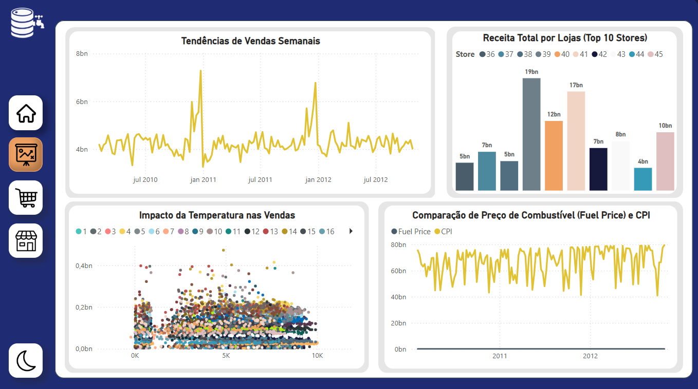
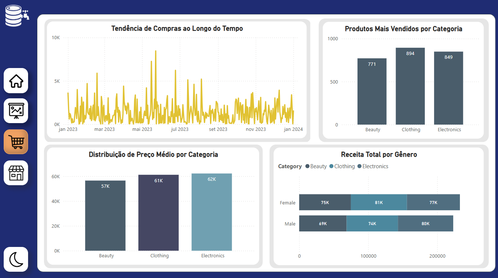
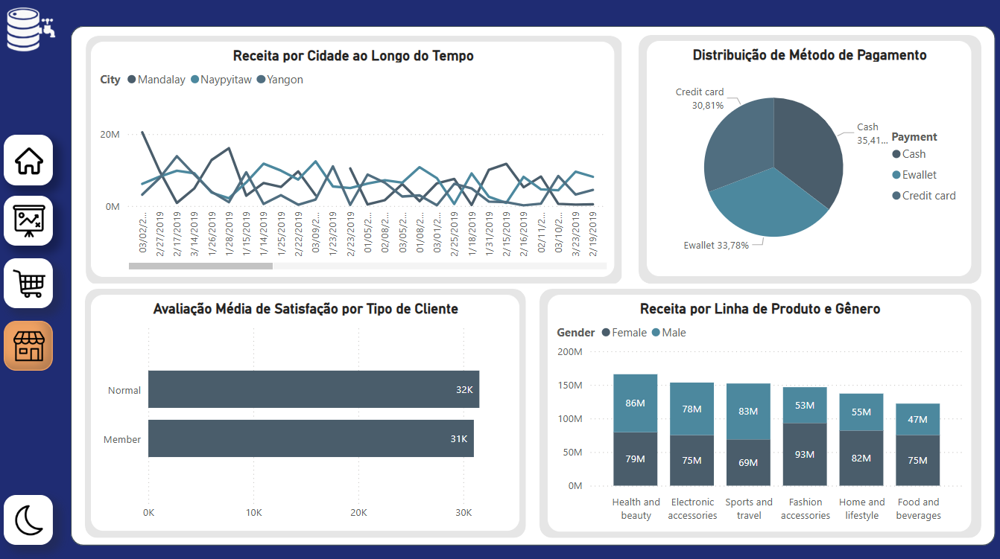

# 🛒 Retail Sales Dashboard – Projeto de Visualização em Power BI

Este projeto tem como objetivo analisar dados de vendas no varejo usando **Power BI**. Foram criadas **três dashboards interativas**, cada uma focada em um tipo de análise diferente, utilizando conjuntos de dados reais e variados. O objetivo é identificar **padrões de consumo**, **fatores que influenciam as vendas** e apresentar **insights estratégicos** com uma navegação intuitiva e layout personalizado.

---

## 🎯 Objetivos do Projeto

- Explorar padrões de comportamento de consumidores em diferentes contextos de varejo.
- Avaliar o impacto de **fatores externos** (como clima e preço de combustível) nas vendas.
- Visualizar tendências, ticket médio, satisfação e categorias com melhor desempenho.
- Desenvolver uma interface intuitiva com **layout visual amigável e navegação lateral**.

---

## 📊 Ferramentas e Tecnologias Utilizadas

- **Power BI Desktop** – Visualização e análise de dados.
- **Excel** – Estruturação e limpeza dos dados.
- **DAX** – Fórmulas para medidas e cálculos personalizados.

---

## 📁 Estrutura do Projeto

---

## 🖼️ Visualizações

### 📌 Walmart Sales Dashboard

**Principais análises:**
- **Tendência de Vendas Semanais:** Identifica oscilações sazonais e picos de venda.
- **Receita por Loja (Top 10):** Destaque para as lojas com maior desempenho financeiro.
- **Impacto da Temperatura nas Vendas:** Correlação entre temperatura e volume de compras.
- **Comparação entre Preço de Combustível e Índice de Preço ao Consumidor (CPI):** Análise econômica sobre influência no consumo.

---

### 📌 Retail Sales Dashboard

**Principais análises:**
- **Tendência de Compras ao Longo do Tempo:** Evolução das vendas ao longo de 2023.
- **Produtos Mais Vendidos por Categoria:** Roupas, eletrônicos e beleza lideram o ranking.
- **Distribuição de Preço Médio:** Comparativo do preço médio por categoria.
- **Receita Total por Gênero:** Análise segmentada de consumo por público masculino e feminino.

---

### 📌 Supermarket Sales Dashboard

**Principais análises:**
- **Receita por Cidade ao Longo do Tempo:** Desempenho entre Mandalay, Naypyitaw e Yangon.
- **Distribuição de Método de Pagamento:** Preferência entre dinheiro, cartão e e-wallet.
- **Satisfação por Tipo de Cliente:** Comparativo entre membros fidelizados e clientes comuns.
- **Receita por Linha de Produto e Gênero:** Perfis de consumo por categoria e sexo.

---

## 📈 Resultados e Aprendizados

- **Domínio do Power BI** para modelagem, navegação com botões e bookmarks.
- Criação de KPIs, filtros e uso de DAX para análise dinâmica.
- Desenvolvimento de visualizações ricas com **histórias de dados claras e objetivas**.
- Construção de layout responsivo e intuitivo com **paleta de cores profissional**.

---

## 🚀 Como Visualizar o Projeto

1. Clone este repositório ou baixe o arquivo `.pbix`.
2. Abra o projeto no **Power BI Desktop**.
3. Interaja com os visuais utilizando os ícones de navegação lateral.

---

## 👤 Autor

Desenvolvido por [**Rafael Santana da Rocha**](https://www.linkedin.com/in/rafaelrocha-analytics/)
